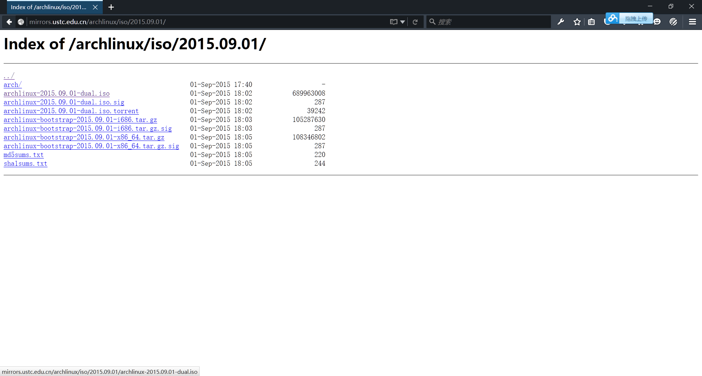
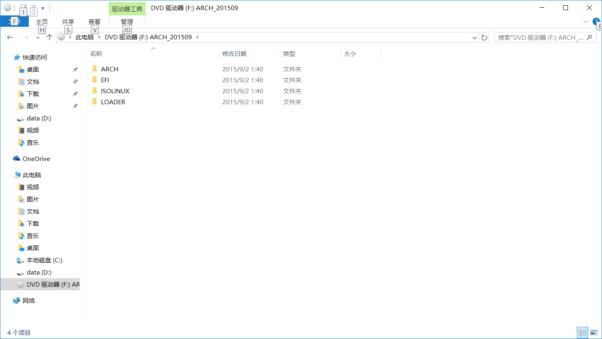
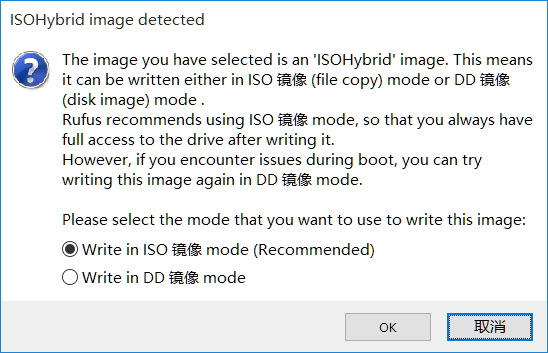
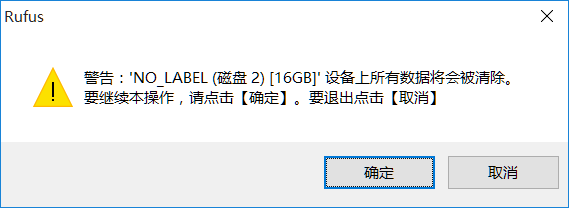

## 安装Arch Linux：一步一步了解Linux系统

现在，我们开始安装Linux系统。我们选用Arch Linux这个发行版，通过安装Arch Linux，可以帮助我们了解很多Linux的基本概念和构建Linux系统的方式。

在下文中，我们会在真实的机器上安装Arch Linux.对于对Linux不熟悉的读者，可以选择使用虚拟机安装，也可以买一块硬盘，在这块硬盘上安装(一块二手的320G硬盘的价格大约为140元)。总之，在安装前请先保证自己的数据不会丢失！

### 准备工作
首先，我们需要一个安装盘。

我们可以从Arch Linux的[官方网站](https://www.archlinux.org/)下载用于安装Arch Linux的iso镜像。而为了加速，世界上有很多开源社区建立了开源镜像站，里面提供很多发行版的iso镜像及软件源。下面我们从中科大的开源镜像站([http://mirrors.ustc.edu.cn/](http://mirrors.ustc.edu.cn/))下载Arch Linux的iso.在这里，我们下载2015.09版本的镜像，文件名为archlinux-2015.09.01-dual.iso.




下载了iso文件后，可以直接把这个文件刻录为光盘。现在很多的机器已经没有光驱了，因此我们要把它做成USB启动盘。以后我会讲解在Linux下制作启动盘的方法，考虑到很多人还在用Windows系统，因此接下来我们将要用[Rufus](https://rufus.akeo.ie/)制作启动盘。

首先下载Rufus.Rufus不需要安装，直接打开就能看到主界面。插入U盘之后，可以看到Rufus可以识别出U盘。Rufus有很多设置项，其中有一项叫“新卷标”，这一项要正确地填写，因为Arch的安装镜像启动时默认根据卷标判断启动所需文件的位置。我们可以先在Windows中挂载下载下来的iso文件，如果你所用的Windows版本没有虚拟光驱功能，可以安装[ImDisk](http://www.ltr-data.se/opencode.html/#ImDisk)后用它挂载iso.



可以看到，镜像的名字叫做`ARCH_201509`.接着，我们在Rufus的“新卷标”处填写`ARCH_201509`，分区方案选择“用于BIOS或MBR计算机的UEFI分区方案”(似乎翻译有问题，应该是用于BIOS和UEFI的MBR方案，大家可以回忆一下关于[系统固件](from-firmware-to-userspace.md#固件firmware)的内容。)，其他都用默认配置。然后在“创建一个启动盘使用”那里，右边有个光盘的图标，点击并选择下载下来的iso文件。最后点“开始”制作启动U盘。


接着Rufus会提示下载syslinux，选择“是”。


然后提示选择写盘模式，我们使用推荐的ISO模式。


最后有个格式化的警告，点击确定，即可格式化U盘并制作启动盘。


### 启动系统
制作好了安装盘之后，可以用这个安装盘启动系统了。启动之后，我们要先做一些安装前的准备工作。

#### 命令行工具的使用
启动之后，我们可以看到一个字符用户界面，有一个提示符，用户可以在上面输入命令，按下回车即可执行。对于没接触过Linux的用户，我们先学习一些常用命令行工具的使用。

* ls: 输入`ls`后回车，可以列出当前所在目录下的文件。Arch Linux的安装盘带有一个install.txt文件，执行ls后可以看到有这个文件。
* nano: 我们先学习一个简单的文本编辑器。执行`nano hello.txt`，在里面输入一些东西，然后按`Ctrl-X`，nano会提示是否保存修改，按y即可保存并退出。然后执行`ls`，看看目录下有什么文件？再执行一次`nano hello.txt`，看看刚才写的东西在不在里面？
* cat和less: 接着上面的的操作，执行`cat hello.txt`，可以发现，刚才往hello.txt写进去的东西都输出了出来。再执行`cat install.txt`看看是什么结果？再用`less install.txt`试试，可以使用上下键移动行，PgUp和PgDn翻页，也可以试试j,k,Ctrl-V,Alt-V这几个键，看完了之后按q键退出。

好了，学会了这几个命令之后，就可以列出当前目录下的文件，以及编辑和查看文件了。在之后的安装过程中，还会用到这些工具。

#### 配置网络
首先，我们执行`ip addr`，可以看到系统识别出的网卡。其中lo为一虚拟网卡，处理127.x.x.x这类特殊IP地址。以en开头的是有线网卡，以wl开头的是无线网卡。不同的网络环境下，配置网络的方式也不一样。下面讲解几种比较常用的网络的配置方法。假设所用有线网卡的名称为enp2s0,无线网卡为wlp4s0.

* 使用静态IP的有线网络: 假设要配置的IP地址为192.168.0.50,子网掩码为255.255.255.0(即最高24位均为1,后面为0),则执行`ip addr add 192.168.0.50/24 dev enp2s0`，并在`/etc/resolv.conf`中配置DNS服务器，如
```
# /etc/resolv.conf, DNS server is 192.168.0.1
nameserver 192.168.0.1
```
* 使用DHCP配置的有线网络: 执行`dhcpcd enp2s0`，没有看到错误提示，提示成功获得IP，则配置成功。
* 无线网络: Arch Linux的安装盘提供一个叫`wifi-menu`的工具，执行`wifi-menu`,选择要连接的无线热点，根据提示输入密码即可。

#### 选择镜像源

### 安装系统

#### 分区

#### 挂载分区

#### 软件安装

#### chroot

#### bootloader

#### 配置系统

### 重新启动
如果你一步一步地走到了这里，恭喜你，Arch Linux系统已经安装在你的机器上了。重新启动看看效果吧。

在终端下执行`reboot`命令，即可重新启动系统。然后，如果你看到了一个启动菜单，那就是GRUB的界面，接着系统启动，最后出现一个登陆提示，说明你已经安装成功了！
